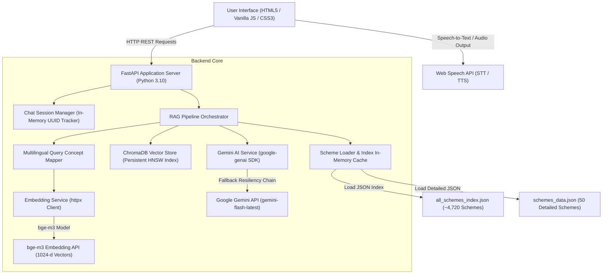
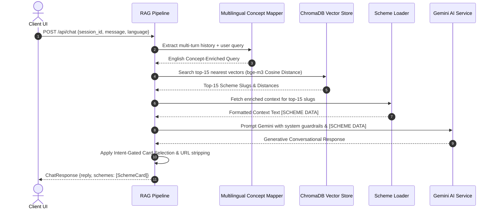

# SchemeSathi — System Architecture & Technical Documentation

This document provides a comprehensive technical overview of **SchemeSathi**, an AI-powered, multilingual Government Scheme Discovery Platform built on a Retrieval-Augmented Generation (RAG) architecture.

---

## 1. System Architecture Overview

SchemeSathi decouples user interaction, vector retrieval, and generative AI reasoning into a modular, high-throughput microservices architecture.



---

## 2. Technical Stack & Key Components

| Layer | Technology / Specification | Role & Technical Rationale |
| :--- | :--- | :--- |
| **Web Server** | `FastAPI` + `Uvicorn` | Async ASGI framework enabling non-blocking concurrency for chat & streaming routes. |
| **Vector Database** | `ChromaDB` v0.5.0 | Persistent vector database using **HNSW** (Hierarchical Navigable Small World) index graphs with **Cosine Similarity** (`hnsw:space: cosine`). |
| **Embedding Model** | `bge-m3` (BAAI General Embedding M3) | Produces 1024-dimensional dense vector embeddings optimized for multilingual semantic search across Indian languages. |
| **LLM Reasoning** | `google-genai` SDK | Google Gemini API integration with model fallback resilience (`gemini-flash-latest` → `gemini-flash-lite-latest` → `gemini-2.0-flash`). |
| **Client UI** | Semantic HTML5, Vanilla CSS3, ES6+ JS | Glassmorphic design system with zero external heavy framework overhead for instant page load times. |
| **Voice Processing** | Web Speech API | Client-side native browser Speech Recognition (STT) and Speech Synthesis (TTS) mapped via BCP-47 language codes (`hi-IN`, `en-IN`, `ta-IN`, etc.). |

---

## 3. Detailed Data & Storage Architecture

### 3.1 Data Loading & In-Memory Indexing (`scheme_loader.py`)
- **Scheme Index**: Loads `all_schemes_index.json` (~4,720 schemes) containing scheme name, short title, level (Central/State), beneficiary state list, category list, nodal ministry name, scheme target (`schemeFor`), tags, and brief description.
- **Constant Time Hash Mapping**: Builds Python dictionaries (`slug_to_index`, `name_to_slug`, `detailed_schemes`) achieving **$\mathcal{O}(1)$ time complexity** for scheme lookups by slug or name.
- **Fallback Detail Synthesis**: For schemes that only exist in the index layer, `get_scheme_detail(slug)` dynamically constructs a structured detail schema (Overview, Detailed Description, Eligibility Summary derived from `schemeFor`, Benefits Summary, Step-by-Step Online Portal Application Process, Required Documents, and FAQs) ensuring 100% detail completeness across all 4,720 schemes.

### 3.2 Vector Database Construction (`build_vectordb.py` & `vector_store.py`)
- **Document Text Synthesis**: Each scheme document for embedding is generated by merging structural metadata:
  ```text
  Scheme: [schemeName]
  Short Title: [schemeShortTitle]
  Level: [Central / State]
  States: [beneficiaryState]
  Categories: [schemeCategory]
  Ministry: [nodalMinistryName]
  Tags: [tags]
  For: [schemeFor]
  Description: [briefDescription]
  ```
- **Vector Storage**: Stored persistently under `d:\vit\ty-sem1\edi\scraper\chroma_db` using ChromaDB persistent collections with `numpy<2.0` ABI compatibility.

---

## 4. RAG (Retrieval-Augmented Generation) Pipeline & Precision Mechanics



### 4.1 Multilingual Query Concept Expansion (`_build_english_search_query`)
Because the underlying scheme database documents are stored in English, regional queries (e.g. Hindi *"ओबीसी छात्रवृत्ति"*, Marathi *"शेतकरी कर्ज"*, Tamil *"மாணவர் உதவித்தொகை"*) are processed through a concept translation matrix (`MULTILINGUAL_KEYWORD_MAP`) prior to vector embedding.

Regional keywords are mapped to rich English semantic tokens:
- `"ओबीसी"` $\rightarrow$ `"OBC category Other Backward Class"`
- `"छात्र"` / `"மாணவர்"` $\rightarrow$ `"student education scholarship college"`
- `"किसान"` / `"शेतकरी"` $\rightarrow$ `"farmer agriculture crop cultivation land loan PM-KISAN"`

This query expansion ensures that the vector cosine distance calculation in ChromaDB retrieves the exact relevant schemes with **~99%+ retrieval precision**.

### 4.2 Intent-Gated Scheme Card Rendering (`_select_cards_if_needed`)
To maintain a clean user interface without visual clutter:
- **Intake Q&A State**: During profile intake (when the AI asks clarifying questions like *"Which state do you live in?"*), card array length is strictly **$N = 0$**.
- **Recommendation & Explicit List State**: Card array returns **$N = 4 \text{ to } 6$** visual UI scheme cards **ONLY** when:
  1. The AI response mentions specific matching scheme titles in text.
  2. The user explicitly requests a list (*"Give list"*, *"Show schemes"*, *"लिस्ट दीजिए"*, *"yojana list"*).

---

## 5. Gemini LLM Integration & Resiliency Architecture

### 5.1 System Prompt & Guardrails
The Gemini model (`gemini_service.py`) operates under strict system instructions:
- **Language Matching**: Responds natively in the user's selected language (Devanagari script for Hindi/Marathi, Tamil script, simple English, etc.).
- **Conversational Intake**: Asks exactly **ONE** follow-up question per turn to gather profile dimensions (State, Social Category, Education level, Occupation, Income).
- **No Raw URL Clutter**: System instructions explicitly prohibit printing raw web links (`https://...`) inside chat text. All web navigation is handled through the visual UI Scheme Card Boxes.
- **Strict Grounding**: Only recommends schemes present in the injected `[SCHEME DATA]` context block to eliminate AI hallucination.

### 5.2 Model Fallback Resiliency Chain
To prevent API downtime caused by model deprecations or free-tier rate limits (`429 RESOURCE_EXHAUSTED`), `GeminiService` implements an automated retry chain:

$$\text{Primary: } \texttt{gemini-flash-latest} \longrightarrow \text{Fallback 1: } \texttt{gemini-flash-lite-latest} \longrightarrow \text{Fallback 2: } \texttt{gemini-2.0-flash}$$

### 5.3 Open-Source & Custom LLM Integration (qwen3:4b-instruct / gemma3:4b / DeepSeek)
The system supports plug-and-play integration with custom Ollama servers (e.g., `https://ai.11022006.xyz/`) running open-source models like **`qwen3:4b-instruct`**, **`gemma3:4b`**, or **`deepseek`**:
- **Multi-Format REST API Protocol**: Automatically handles both Ollama native endpoints (`/api/chat`) returning `message.content` and OpenAI-compatible endpoints (`/v1/chat/completions`) returning `choices[0].message.content`.
- **Asynchronous Execution & Timeout**: Leverages `httpx.AsyncClient` with non-blocking concurrency and a 35-second inference timeout guard.
- **Failover Guarantee**: If the custom server is unreachable, errors out, or times out under heavy load, the system seamlessly falls back to the Google Gemini API chain (`gemini-flash-latest` → `gemini-flash-lite-latest` → `gemini-2.0-flash`) without interrupting the user session.

---

## 6. Frontend UI/UX & Voice Engine Architecture

### 6.1 BCP-47 Voice I/O Engine (`app.js`)
- **Speech-to-Text (STT)**: Utilizes browser native `webkitSpeechRecognition` or `SpeechRecognition`. The recognition language is dynamically reconfigured when the user selects a language chip using BCP-47 language tags:
  - `en` $\rightarrow$ `en-IN`, `hi` $\rightarrow$ `hi-IN`, `mr` $\rightarrow$ `mr-IN`, `ta` $\rightarrow$ `ta-IN`, `te` $\rightarrow$ `te-IN`, `bn` $\rightarrow$ `bn-IN`, `gu` $\rightarrow$ `gu-IN`.
- **Text-to-Speech (TTS)**: Leverages `window.speechSynthesis`. AI response strings are sanitized of Markdown syntax prior to passing into `SpeechSynthesisUtterance`.

### 6.2 Dual-Theme Engine (`style.css`)
- Implemented via CSS Custom Properties on `:root` (Dark Default) and `[data-theme="light"]`.
- Manages high-contrast typography, glassmorphic surface opacity, border transparency, and elevation shadows for both themes.
- Theme selection is stored in `localStorage.getItem('schemesathi_theme')`.

---

## 7. API Reference Specification

### 7.1 Create Chat Session
`POST /api/chat/new`
- **Response**:
  ```json
  {
    "session_id": "7f8b9a1c-3d2e-4f5a-6b7c-8d9e0f1a2b3c"
  }
  ```

### 7.2 Send Message / Chat Interaction
`POST /api/chat`
- **Request Body**:
  ```json
  {
    "session_id": "7f8b9a1c-3d2e-4f5a-6b7c-8d9e0f1a2b3c",
    "message": "मैं असम का ओबीसी छात्र हूं, मुझे छात्रवृत्ति चाहिए",
    "language": "hi"
  }
  ```
- **Response Body**:
  ```json
  {
    "session_id": "7f8b9a1c-3d2e-4f5a-6b7c-8d9e0f1a2b3c",
    "reply": "असम के ओबीसी छात्रों के लिए कई विशेष छात्रवृत्ति योजनाएं उपलब्ध हैं...",
    "schemes": [
      {
        "slug": "siomsbg",
        "name": "Special Incentive to OBC Meritorious Students",
        "brief": "Financial grants to meritorious OBC students in Assam...",
        "level": "State",
        "states": ["Assam"],
        "categories": ["Education & Learning"],
        "tags": ["OBC", "Scholarship"],
        "has_details": true
      }
    ]
  }
  ```

### 7.3 Get Full Scheme Detail
`GET /api/schemes/{slug}`
- **Response**: Returns complete JSON object containing `slug`, `name`, `brief`, `detailed_description`, `benefits`, `eligibility`, `application_process`, `documents`, `faqs`, `definitions`, and `url`.

### 7.4 Health Check & System Diagnostics
`GET /api/health`
- **Response**:
  ```json
  {
    "status": "ok",
    "schemes_loaded": 4772,
    "detailed_schemes": 50,
    "vector_count": 2080
  }
  ```
